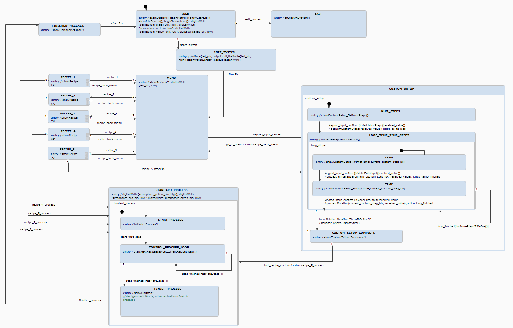
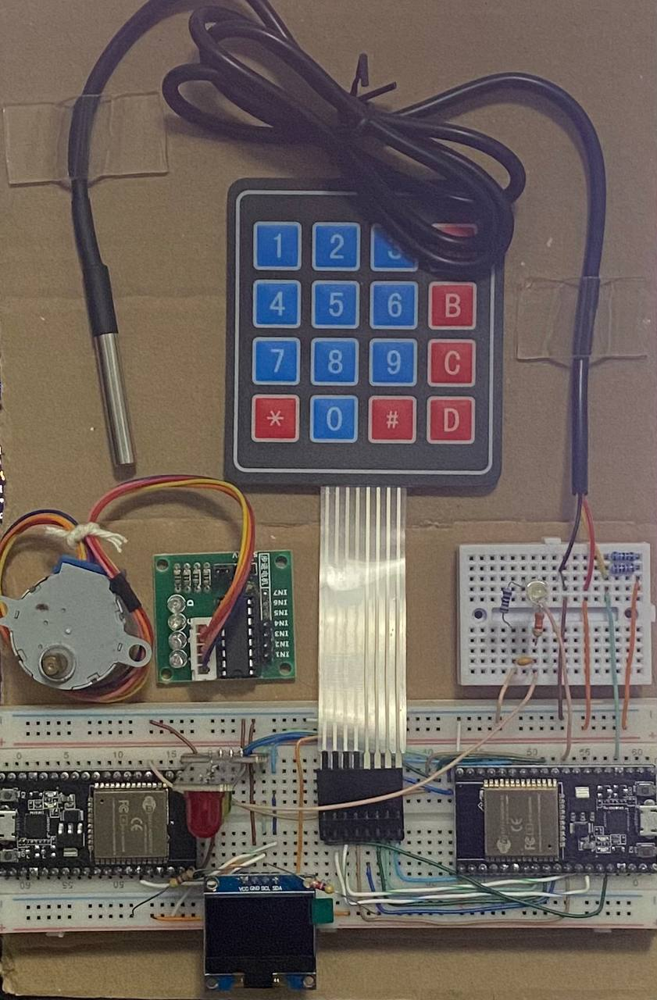
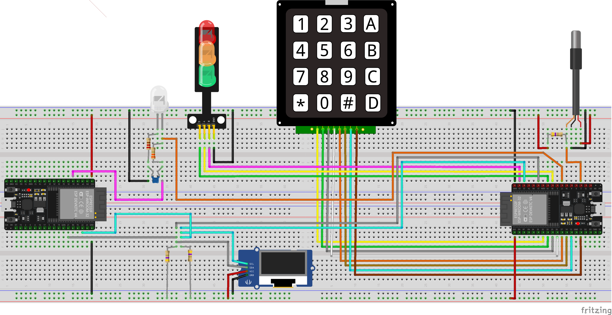
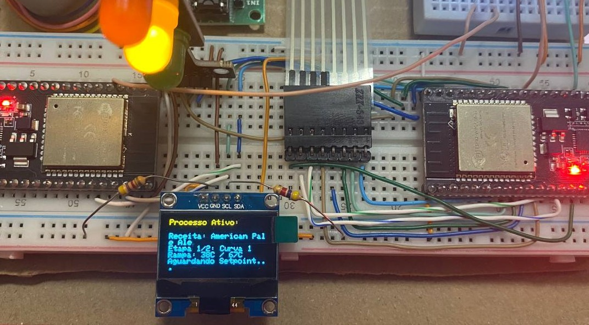
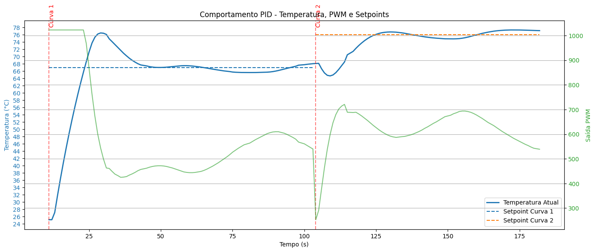

# 🍺 Controlador de Temperatura para Produção de Cerveja Artesanal

Um sistema embarcado moderno e modular para monitoramento e controle térmico durante a brassagem de cerveja artesanal, baseado em perfis de temperatura ajustáveis e lógica de controle robusta.

## Índice

1. [Visão Geral](#visão-geral)  
2. [Objetivos](#objetivos)  
3. [Tecnologias Utilizadas](#tecnologias-utilizadas)  
4. [Arquitetura do Sistema](#arquitetura-do-sistema)  
5. [Modelagem e Lógica de Estados](#modelagem-e-lógica-de-estados)  
6. [Código e Integração Itemis](#código-e-integração-itemis)
7. [Plano de Entregas e Metodologia](#plano-de-entregas-e-metodologia)  
8. [Requisitos do Projeto](#requisitos-do-projeto)  
9.  [Funcionalidades Extras](#funcionalidades-extras)  
10. [Receitas Utilizadas](#receitas-utilizadas)
11. [Resultados e Logs de Processo](#resultados-e-logs-de-processo)
12. [Considerações Finais e Melhorias Futuras](#considerações-finais-e-melhorias-futuras)
13. [Changelog](#changelog)

---

### Visão Geral

Este projeto tem como objetivo desenvolver um controlador inteligente para automatizar o processo de fabricação de cerveja artesanal. O sistema gerencia a temperatura do mosto e ativa automaticamente um mixer, garantindo homogeneidade térmica e aderência a curvas de temperatura personalizáveis.

Com uma arquitetura flexível, o sistema pode ser simulado em ambiente de desenvolvimento e implantado em microcontroladores reais, permitindo testes eficientes e facilidade de manutenção.

### Objetivos

- **Controle térmico preciso:** Manter o mosto dentro da faixa desejada com controle PID e/ou ON/OFF com histerese.
- **Homogeneização eficiente:** Acionar o mixer automaticamente conforme a diferença de temperatura entre sensores.
- **Curvas customizáveis:** Permitir definição e carregamento de receitas personalizadas.
- **Segurança embutida:** Detectar falhas e fornecer alertas visuais/sonoros.
- **Interface acessível:** Oferecer informações em tempo real via display e comunicação serial.
- **Portabilidade e testes:** Simular em PC e transferir facilmente para o ESP32.

---

### Tecnologias Utilizadas

- **Plataforma:** ESP32 (com suporte a FreeRTOS)
- **Linguagem:** C++ com princípios de orientação a objetos
- **Modelagem de Estados:** itemis CREATE / itemis CREATE
- **Interface com Usuário:**
  - Display OLED ou LCD via I2C
  - Teclado matricial 4x4
  - Comunicação UART com PC
- **Sensores:** Temperatura (I2C ou OneWire)
- **Atuadores:** Resistência (PWM), Mixer (GPIO/PWM)
- **Versionamento:** Git + GitHub
- **Documentação:** Doxygen
- **Testes:** Unity ou Google Test *(em definição)*

---

### Arquitetura do Sistema
O controlador é baseado em uma arquitetura modular e desacoplada, onde o microcontrolador ESP32 atua como o núcleo de processamento central, executando tarefas paralelas por meio do FreeRTOS, gerenciando sensores, atuadores e a interface com o usuário.

##### Camada de Sensoriamento
- Sensores de Temperatura: DS18B20 (OneWire) ou simulados via I2C entre dois ESP32 (mestre/escravo)
- Dados são capturados periodicamente por tarefas do sistema operacional (RTOS)

##### Camada de Controle
- Controle ON/OFF com Histerese: simples e seguro, usado como fallback
- Controle PID: integrado via biblioteca PID_v1, ajustando o PWM para regular o aquecimento com precisão
- O controle atua sobre a resistência de aquecimento, com saídas moduladas por PWM

##### Camada de Atuação
- Mixer: acionado via GPIO com lógica baseada na diferença entre sensores (Delta T)
- Resistência: controlada por PWM com duty cycle ajustado pelo controlador
- LEDs: usados para alertas e status de sistema

##### Camada de Interface
- Display OLED: apresenta temperatura atual, setpoint, tempo restante e status do sistema
- Teclado 4x4: entrada de comandos, seleção de receitas, navegação por menus
- UART: comunicação com PC para upload de receitas, logs e visualização remota

##### Camada de Lógica de Estados
- Implementada com itemis CREATE (itemis CREATE), gerando código em C++
- Organiza os fluxos de operação: IDLE, MENU, STANDARD_PROCESS, HEATING, RESTING, FINISHED, etc.
- Transições automáticas com base em eventos

##### Abstração de Hardware (HAL)
- Todos os periféricos (sensores, displays, atuadores) são acessados por meio de camadas de abstração, permitindo simulação em ambiente de PC
- Essa arquitetura permite alta portabilidade e facilita manutenção e testes automatizados

##### Simulação Mestre-Escravo
- Sistema alternativo onde o ESP32 "mestre" controla a brassagem e o ESP32 "escravo" simula a resposta térmica do ambiente
- Utiliza modelo de inércia térmica (RC) para testes realistas do controle PID

---

### Modelagem e Lógica de Estados

Para garantir previsibilidade e segurança no controle da brassagem, a lógica do sistema foi inteiramente modelada por meio de uma máquina de estados finita, utilizando a ferramenta [itemis CREATE](https://www.itemis.com/en/). Essa modelagem define claramente o fluxo de operação do sistema, suas transições, eventos esperados e comportamentos em cada estado.

Abaixo, apresentamos o diagrama completo da máquina de estados desenvolvida para este projeto:

📌 **Estados Principais:** `IDLE`, `MENU`, `STANDARD_PROCESS`, `HEATING`, `RESTING`, `FINISHED`, `EXIT`  ... etc<br>
🔁 **Eventos de Transição:** `start_button`, `tempOk`, `timeout`, `erroSensor`, `abort` ... etc


*Modelo visual criado com itemis CREATE.*
*Outros arquivos podemser vistos em ```../itemis/project/```*

Essa modelagem permite a geração automática de código C++, que é posteriormente integrado ao projeto embarcado. Isso garante consistência entre o comportamento simulado e a implementação real.

#### Componentes Visíveis na Bancada:
- ESP32 com módulos GPIO expostos
- Display OLED via I2C
- Teclado matricial 4x4
- Sensor de temperatura (DS18B20)
- LED RGB ou semáforo de estado
- Resistência controlada via PWM
- Cabos de alimentação e conexões UART
- ESP32 Mestre-Escravo
- Mixer e Controlador

#### Imagens:

##### Montagem física:

*Vista geral com todos os componentes interligados.*

##### Fritzing:

*Vista geral das ligações dos componentes interligados no Fritzing.*

##### Detalhe do Display:

*Interface de usuário: teclado matricial e display OLED indicando a etapa atual da brassagem.*

#### 🎥 Demonstração em Vídeo:
Clique abaixo para ver a operação do sistema em tempo real durante uma simulação de brassagem:

[▶️  YouTube](https://youtu.be/LINK)
**TODO**

---

### Código e Integração Itemis

A ferramenta itemis CREATE gerou automaticamente os arquivos-fonte para representar a máquina de estados, incluindo:

- `Statechart.h`
- `Statechart.cpp`
- `sc_statemachine.h`, `sc_eventdriven.h`, `sc_timer.h`, `sc_types.h`

Esses arquivos foram integrados ao ambiente de desenvolvimento do ESP32, com callbacks definidos em `StatechartCallback.h` para lidar com as ações de entrada (`entry`) e transições de estados.

* Os arquivos podem ser visualizados em:

```
../freeRTOS/borraco/src/
```

Toda a lógica de resposta ao usuário, atualização de display e leitura do teclado é feita dentro do StatechartCallback, garantindo que o fluxo operacional siga rigorosamente a modelagem definida no itemis CREATE.


* Estrutura de Pastas:

```bash
/src-gen → arquivos gerados
/src     → lógica de aplicação
/include → abstrações de hardware e callbacks
```

Ao modificar a máquina no itemis CREATE e regerar o código, o sistema se adapta automaticamente às novas transições, preservando a lógica central.

---

### Plano de Entregas e Metodologia
O projeto foi estruturado em três fases principais de entrega, cada uma com foco progressivo na consolidação da solução embarcada. Essa divisão visa facilitar o desenvolvimento incremental, permitindo testes contínuos e validação parcial de funcionalidades antes da integração final.

##### Entrega 1 — Fundação e Estrutura Lógica
Objetiva estabelecer a base do projeto, incluindo a modelagem conceitual, estrutura lógica de controle e primeiros testes de fluxo:

- Levantamento e categorização de requisitos funcionais e não funcionais
- Definição da curva padrão de brassagem a ser utilizada
- Modelagem da máquina de estados no itemis CREATE (itemis CREATE)
- Criação do repositório GitHub e organização da base de código inicial

##### Entrega 2 — Desenvolvimento de Funcionalidades-Chave
Foca na implementação dos principais módulos de hardware e controle, promovendo a simulação completa de um processo de brassagem:

- Integração com sensores de temperatura (reais ou simulados via I2C)
- Controle de aquecimento via ON/OFF com histerese e/ou PID
- Visualização de dados em display (OLED/LCD)
- Interface com teclado matricial 4x4
- Comunicação com PC via UART para logs e comandos
- Implementação da lógica de receitas e controle por etapas

##### Entrega 3 — Integração Total e Recursos Avançados
Consolida o sistema com foco em robustez, segurança, testes e usabilidade:

- Adição de funcionalidades extras: alarme sonoro, semáforo LED, logs
- Implementação de detecção de falhas (sensores, comunicação)
- Geração de documentação automatizada via Doxygen
- Testes finais e simulação realista com modelo de inércia térmica
- Apresentação e demonstração funcional completa

---

### Requisitos do Projeto
Os requisitos foram categorizados em Funcionais (o que o sistema deve fazer) e Não Funcionais (como o sistema deve funcionar). O progresso de cada requisito é visualizado através de uma barra de status.

| ID | Tipo | Requisito | Prioridade | Progresso | Entrega Relacionada | Observações |
| :---- | :---- | :---- | :---- | :---- | :---- | :---- |
| **RF01**  | **Funcional**   | O sistema deve aplicar algoritmos de controle (PID e/ou ON/OFF com histerese) para manter a temperatura do mosto dentro de uma margem de $\pm 1 ^\circ C$ do *setpoint* definido pela curva de brassagem, acionando as resistências de aquecimento. | Alta | Concluído [🟩🟩🟩🟩🟩] 100% | Entrega 2 | O controle PID foi integrado. A função do controlTask calcula o PID e aplica o Output diretamente ao PWM. |
| **RF02**  | **Funcional** | O sistema deve carregar e executar uma curva de temperatura padrão pré-configurada (ex: 67°C por X min, 78°C por Y min, 100°C por Z min) ao iniciar a brassagem. | Alta          | Concluído [🟩🟩🟩🟩🟩] 100% | Entrega 1 | Deixa claro que a curva padrão é a default e como ela é iniciada. (Receitas definidas e lidas, lógica de etapas implementada). |
| **RF03** | **Funcional** | O sistema deve permitir o *upload* de curvas de temperatura customizadas via interface serial (UART), ou via comandos em tela (KEYPAD 4X4). Cada curva deve conter múltiplos *steps* definidos por temperatura e duração, e o sistema deve validar a integridade dos dados recebidos. | Alta | Pendente [🟥🟥🟥🟥🟥] 0% | Entrega 2 | Detalha a forma de *upload* e a necessidade de validação. |
| **RF04**  | **Funcional** | O sistema deve ativar automaticamente o *mixer* quando a diferença de temperatura entre quaisquer dois sensores exceder $1^\circ C$ (Delta T), com um retardo de ativação configurável, para garantir a homogeneização do mosto. | Alta | Concluído [🟩🟩🟩🟩🟩] 100% | Entrega 2 | As novas implementações que foram sugeridas move a lógica para o PID, dessa maneira utiliza a lógica via software e não hardware, desabilitando temporariamente a implementação física do componente do mixer*. |
| **RF05**  | **Funcional** | O sistema deve exibir continuamente no *display* OLED (ou LCD) a temperatura atual do mosto (obtida pelo sensor principal), o *setpoint* da etapa atual da curva, o tempo restante para a etapa atual e o *status* operacional do *mixer* e resistências. | Alta          | Concluído  [🟩🟩🟩🟩🟩] 100% | Entrega 2 | A exibição foi aprimorada para indicar claramente a fase de rampa, mostrando "Aguardando Setpoint..." ou o tempo restante, tornando o feedback ao usuário muito mais completo e preciso em relação ao estado real do processo. |
| **RF06**  | **Funcional**   | O sistema deve emitir alertas visuais (LEDs) ou sonoros (BUZZER) para notificar o usuário sobre erros críticos de operação (ex: falha de sensor, sobreaquecimento, erro de comunicação), indicando o tipo de falha. | Alta | Concluída [🟩🟩🟩🟩🟩] 100% | Entrega 3 | Especifica os tipos de alerta e a informação a ser passada (tipo de falha). |
| **RF07**  | **Funcional** | O sistema deve permitir ao usuário selecionar o modo de controle (PID ou ON/OFF) antes ou durante o início de uma nova brassagem, através da interface de usuário (teclado ou serial). | Alta          | Concluído [🟩🟩🟩🟩🟩] 100% | Entrega 2 | Na implementação 0.8.0 foi implementado o sistema via histerese ON/OFF porém se notou certas inconsistências no desempenho do projeto, no qual não é ideal em uma aplicação real, neste caso foi substituído pela versão 0.9.0 na qua implementa um sistema de PID mais robusto e operacional, desse modo esperamos um comportamento mais esperado do ideal e mais profissional. |
| **RF08**  | **Funcional**   | O sistema deve implementar um "Modo de Calibração" para os sensores de temperatura, permitindo ao usuário ajustar *offsets* ou fatores de calibração para leituras mais precisas, com base em temperaturas de referência conhecidas. | Baixa | Concluído [🟩🟩🟩🟩🟩] 100% | Entrega 3 | O sistema permite ajustes porém são hard-coded, sendo possível ajustar antes de fazer o upload do sistema. |
| **RF09**  | **Funcional**   | O sistema deve permitir ao usuário visualizar os parâmetros específicos da curva de brassagem em tempo real (ex: *setpoint* de temperatura, duração da etapa) através da comunicação UART, sem interromper o processo atual. | Baixa         | Concluído [🟩🟩🟩🟩🟩] 100%      | Entrega 2 | O sistema é capaz de fornecer informações ao usuário via UART e via DisplayOLED, detalhando todos os passos e progresso em tempo real. |
| **RF10**  | **Funcional**   | O sistema deve registrar em memória não volátil (*Flash* ou EEPROM) os parâmetros de cada brassagem concluída (curva utilizada, temperaturas máximas/mínimas atingidas, duração total) e permitir a consulta desses *logs* via UART. | Média         | Concluído [🟩🟩🟩🟩🟩] 100%      | Entrega 3 | Funcionalidade adicional de histórico, útil para otimização de receitas. |
| **RF11**  | **Funcional**   | O sistema deve suportar a criação de "receitas", que são sequências pré-definidas de curvas de brassagem (ex: *Mash*, *Boil*, *Fermentação*), permitindo ao usuário selecionar e executar uma receita completa. | Alta | Concluído [🟩🟩🟩🟩🟩] 100%      | Entrega 3 | A lógica e o gerenciamento das receitas estão integradas no código, sendo possível adicionar quantas receitas fixas quiser com algumas regras de neócio envolvidas como limites de curvas por exemplo. |
| **RF12**  | **Funcional**   | O sistema deve fornecer *feedback* visual (ex: ícones no *display* ou LEDs de *status*) sobre o estado atual dos atuadores (resistências ligadas/desligadas, *mixer* ativo/inativo), mesmo quando não houver erro crítico, para facilitar o monitoramento do processo. | Média | Concluído [🟩🟩🟩🟩🟩] 100%      | Entrega 2           | Os setups, aquecedores, PWM, i2C, etapas e todos os periféricos existentes foram substituídos por logs no Serial Monitor, os feedbacks visuais são mostrados na barra quando o sistema é iniciado e são gerados a cada step do processo. |
| **RNF01** | **Não Funcional** | A arquitetura de *software* deve ser portável, permitindo que o sistema seja executado tanto em uma plataforma embarcada (ESP32) quanto em um ambiente de simulação no PC, utilizando abstração de *hardware* (HAL) para facilitar a troca de implementações de periféricos. | Alta | Concluído [🟩🟩🟩🟩🟩] 100%      | Entrega 3           |  A inclusão da biblioteca PID e a forma como ela se integra (Setpoint, Input, Output) demonstram que o controle é desacoplado da origem da temperatura e do destino do PWM. O simulador I2C aprimorado (com modelo de inércia) mesmo com o uso de uma simulação feita através de um Mestre-Escravo reforça esse requisito. |
| **RNF02** | **Não Funcional** | O código-fonte deve ser implementado em C++ seguindo princípios de Orientação a Objetos (OO), com uso extensivo de polimorfismo e métodos virtuais, para garantir modularidade, reusabilidade e extensibilidade do sistema. | Alta | Em andamento [🟩🟩🟩🟩🟩] 100%     | Todas | A adição da biblioteca PID como um objeto e a interação com ela reforçam ainda mais as boas práticas de OO e encapsulamento. |
| **RNF03** | **Não Funcional** | O projeto deve ser versionado no GitHub com um histórico de *commits* claro e descritivo, refletindo o progresso incremental e as mudanças significativas em cada funcionalidade implementada. | Alta | Concluído  [🟩🟩🟩🟩🟩] 100%      | Todas | Todosos commits durante o projeto foram feitos periodicamente e com comentários claros e descritivos para enfatizar a qualidade do versionamento. |
| **RNF04** | **Não Funcional** | Toda a base de código deve ser documentada utilizando Doxygen, gerando uma documentação técnica completa das funções, classes, variáveis e módulos, facilitando a compreensão e manutenção por outros desenvolvedores. | Alta | Concluído [🟩🟩🟩🟩🟩] 100%      | Entrega 3 | Especifica "toda a base de código" e o benefício da documentação. |
| **RNF05** | **Não Funcional** | O sistema deve incorporar proteção elétrica robusta contra curtos-circuitos, sobreaquecimento e surtos de tensão nos circuitos de controle das resistências e do *mixer*, garantindo a segurança do equipamento e do usuário. | Baixa         | Concluído [🟩🟩🟩🟩🟩] 100%      | Entrega 3           | A ideaia do projeto era ter algo robusto como circuito com fusíveis, termistores e testes elétricos necessários, porém devido o andaento do projeto não foi necessário a implementação de sistemas como esses pois os dispositivos usados são de baixa voltagem. |
| **RNF07** | **Não Funcional** | Deve ser fornecido um manual de montagem detalhado, com diagramas de fiação, fotos ilustrativas e lista de materiais (BOM), para permitir que um usuário replique o *hardware* do sistema. | Média         | Concluído [🟩🟩🟩🟩🟩] 100%      | Entrega 3           | Apesar do projeto já ser previamente montado para seu transporte e uso. A montagem foi descrita na documentação, com imagens e demonstrações em vídeo. |
| **RNF08** | **Não Funcional** | O sistema deve gerar *logs* de eventos detalhados (ex: mudanças de *setpoint*, ativação/desativação de atuadores, erros de sensor) via UART, que possam ser facilmente consumidos e analisados por uma aplicação no PC para depuração e monitoramento. | Alta          | Concluído [🟩🟩🟩🟩🟩] 100%      | Entrega 3           |  Os logs seriais no mestre e escravo são bem descritivos via UART e possuem informações visuais através de LEDS e DisplayOLED.  |
| **RNF09** | **Não Funcional** | O *software* deve ser projetado com alta coesão e baixo acoplamento entre os módulos, utilizando interfaces bem definidas para facilitar futuras expansões e manutenções sem impacto em outras partes do sistema. | Média | Concluído [🟩🟩🟩🟩🟩] 100%      | Entrega 2           |  A adição do PID como uma biblioteca separada que interage com Input/Output globais reforça ainda mais o baixo acoplamento e a modularidade. exigida por esse requisito.  |
| **RNF10** | **Não Funcional** | O sistema deve reagir a alterações nos sensores ou comandos de controle e atualizar o estado dos atuadores e do *display* em no máximo 500ms, para garantir uma experiência de usuário responsiva e controle em tempo real. | Baixa         | Concluído [🟩🟩🟩🟩🟩] 100%      | Entrega 2           | A malha de controle PID é rápida, mas a interface com o usuário poderia passar por um processo melhor de ajustes finos, porém está funcional. |
| **RNF11** | **Não Funcional** | O *software* deve ser submetido a testes unitários automatizados para as camadas de lógica de controle e módulos críticos, utilizando um *framework* de teste (ex: Unity, Google Test) para garantir a robustez e correção do código. | Baixa         | Pendente [🟥🟥🟥🟥🟥] 0%      | Entrega 3           | Desenvolver testes usando *frameworks* como Unity ou GoogleTest. |
| **RNF12** | **Não Funcional** | O sistema deve permitir o ajuste manual da potência de saída para as resistências (ex: via PWM), permitindo ao usuário sobrescrever temporariamente o controle automático em situações específicas de *fine-tuning* ou emergência. | Baixa         | Concluído [🟩🟩🟩🟩🟩] 100%      | Entrega 2           | Possui estrutura hard-coded preparada para receber dados facilmente. |
| **RNF13** | **Não Funcional** | O sistema deve detectar e alertar sobre a perda de comunicação com qualquer sensor I²C (ex: por *timeout* ou falha de CRC), e tentar restabelecer a comunicação automaticamente antes de reportar uma falha crítica. | Baixa         | Concluído [🟩🟩🟩🟩🟩] 100%      | Entrega 3           | A lógica na simulação da temperatura continua a ser a principal detecção de falha de comunicação I2C. Poderia ter retries ou recuperação mais avançada porém é funcional. |
| **RNF14** | **Não Funcional** | O sistema deve ser capaz de calibrar automaticamente ou semi-automaticamente os sensores de temperatura durante o processo de brassagem, compensando variações devido à imersão ou tipo de sensor, utilizando pontos de calibração conhecidos. | Alta          | Concluído [🟩🟩🟩🟩🟩] 100%      | Entrega 2           | O uso do PID controla e calibra automaticamente a temperatura de brasagem. |
| **RNF15** | **Não Funcional** | A interface de usuário via teclado deve ser intuitiva e eficiente, permitindo a navegação pelos menus e a entrada de dados com um mínimo de passos, para uma boa experiência do usuário. | Média         | Concluído [🟩🟩🟩🟩🟩] 100%      | As informações do processo no display dão clareza para o usuário, com informações claras, tornando a IHM mais eficiente em transmitir o estado do processo. |
| **RNF16** | **Não Funcional** | O consumo de energia do sistema deve ser otimizado para operação de longo prazo, especialmente em modos de espera ou monitoramento, para minimizar o aquecimento desnecessário e potencializar o uso de fontes de energia. | Baixa         | Concluído [🟩🟩🟩🟩🟩] 100%      | Entrega 2           | Foi implementado sistemas de circuit-breaker do sistema, desligando atuadores e periféricos após uso das receitas, visando o consumo de energia do sistema. |
| **RNF17** | **Não Funcional** | O código deve seguir um guia de estilo de codificação (ex: Google Style Guide, MISRA C/C++) para garantir consistência, legibilidade e manutenibilidade em todo o projeto. | Baixa         | Concluído [🟩🟩🟩🟩🟩] 100%      | Entrega 3           | Código escrito em formato clean code em C++ e com bastante detalhamento para documentação. |
| **RNF18** | **Não Funcional** | A interface de comunicação serial (UART) deve ser baseada em um protocolo bem definido (ex: ASCII com *checksum* ou JSON para comandos/dados), garantindo a robustez e a interoperabilidade com *softwares* externos (PC). | Alta          | Concluído [🟩🟩🟩🟩🟩] 100%      | Entrega 2           | A interface de comunicação é feita via displayOLED e teclado matricial. |
| **RNF19** | **Não Funcional** | O sistema deve ter capacidade de *over-the-air (OTA) update* para o *firmware*, permitindo atualizações de *software* remotas sem a necessidade de conexão física via USB, facilitando a manutenção e a adição de novas funcionalidades pós-implantação. | Média         | Pendente [🟥🟥🟥🟥🟥] 0%      | Entrega 3           | Um requisito de manutenção moderna para sistemas embarcados, crucial para a longevidade do produto. |
| **RNF20** | **Não Funcional** | O *software* deve ser resiliente a falhas temporárias (ex: ruído elétrico, pequenas interrupções de comunicação), implementando mecanismos como *debouncing* para entradas digitais, *timeouts* com *retries* para comunicações e inicialização segura dos periféricos. | Alta          | Concluído [🟩🟩🟩🟩🟩] 100%      | Entrega 2           | O modelo de inércia térmica no simulador escravo torna a simulação mais realista e robusta, e a controle lida com valores de temperatura (mesmo que simulados) com mais complexidade. Isso reforça a resiliência do sistema de controle em si. |

### Observações:

#### Progresso Geral

- Requisitos Funcionais: **11/12** ✅
- Requisitos Não Funcionais: **18/20** ✅

**Total geral: 29/32 requisitos concluídos** (🔵 ~90%)

---

#### Requisito Funcional - 03: 

* **Descrição:**

*O sistema deve permitir o *upload* de curvas de temperatura customizadas via interface serial (UART), ou via comandos em tela (KEYPAD 4X4). Cada curva deve conter múltiplos *steps* definidos por temperatura e duração, e o sistema deve validar a integridade dos dados recebidos.*

* **Status:**

Durante o desenvolvimento do projeto, um dos requisitos inicialmente propostos precisou ser removido da versão final apresentada. Apesar de sua estrutura conceitual estar devidamente modelada na plataforma Itemis, a implementação prática no código ainda demandava ajustes significativos para garantir um funcionamento estável e conforme os padrões de qualidade exigidos.

Em função do tempo disponível para entrega e da complexidade envolvida na correção de determinados bugs, optou-se por desativar temporariamente essa funcionalidade. Essa decisão foi tomada com o intuito de priorizar a entrega de um sistema funcional, estável e coerente com os demais requisitos implementados, evitando que possíveis inconsistências técnicas impactassem negativamente na experiência de uso ou na avaliação do projeto.

A funcionalidade removida permanece documentada e estruturada de forma modular, o que possibilita sua futura reintegração ao sistema com as devidas correções e validações. Essa abordagem evidencia a preocupação com a qualidade do código e com a viabilidade técnica do projeto, demonstrando uma postura responsável diante das limitações de tempo e recursos enfrentadas na reta final do desenvolvimento.

* **Planejamento Futuro:**

Esta funcionalidade permanece documentada e com estrutura modular, permitindo que seja reintegrada em futuras versões do sistema com as devidas correções e validações.

#### Requisito Não Funcional - 11:

* **Descrição:**

O *software* deve ser submetido a testes unitários automatizados para as camadas de lógica de controle e módulos críticos, utilizando um *framework* de teste (ex: Unity, Google Test) para garantir a robustez e correção do código.

* **Status:**

Durante a fase final de desenvolvimento, foi priorizado a estabilização das funcionalidades principais e a integração dos módulos em tempo real, o que exigiu esforços intensivos de depuração e testes manuais. Com isso, a implementação de testes unitários automatizados, embora considerada uma boa prática de engenharia de software, acabou sendo adiada devido à limitação de tempo e à necessidade de ajustes constantes no código base.

Além disso, a configuração adequada do ambiente de testes com frameworks como Unity ou Google Test requer um tempo inicial de estruturação e integração que não pôde ser absorvido sem comprometer o cronograma das demais entregas.

* **Planejamento Futuro:**

A inclusão de testes automatizados continua sendo uma etapa planejada para versões futuras do projeto porém segue com **prioridade baixa**. Com a estabilização da base de código, será possível estruturar um ambiente de testes e implementar uma suíte de testes unitários abrangente, aumentando a confiabilidade e facilitando futuras manutenções.

#### Requisito Não Funcional - 19:

* **Descrição:**

O sistema deve ter capacidade de *over-the-air (OTA) update* para o *firmware*, permitindo atualizações de *software* remotas sem a necessidade de conexão física via USB, facilitando a manutenção e a adição de novas funcionalidades pós-implantação.

* **Status:**

A implementação do mecanismo de atualização OTA exige uma arquitetura de firmware mais robusta, com particionamento de memória apropriado (dual bank ou bootloader dedicado), além de um gerenciamento seguro de pacotes de atualização e verificação de integridade. Durante a fase de desenvolvimento, constatou-se que a plataforma de hardware utilizada apresentava limitações de memória e conectividade que comprometeriam a implementação segura e confiável desse recurso.

Além disso, o desenvolvimento de um sistema OTA funcional implicaria em um aumento considerável na complexidade do projeto, demandando integração com protocolos de rede, criptografia e fallback seguro em caso de falha durante a atualização — etapas que exigiriam tempo e testes adicionais fora do escopo da entrega atual.

Diante dessas limitações técnicas e do foco na entrega de um sistema funcional e testável localmente, optou-se por adiar esse requisito para versões futuras.

* **Planejamento Futuro:**

Para o projeto viu-se com o andamento que a funcionalidade de OTA foi completamente descartada para versões futuras do sistema, especialmente em contextos de implantação real.

---

### Funcionalidades Extras
Nesta etapa do projeto, foram incorporadas funcionalidades adicionais que, embora não estejam entre os requisitos principais, enriquecem a usabilidade e o controle do sistema.

##### Teclado Matricial 4x4:
Permite ao usuário navegar por menus, selecionar receitas, iniciar ou abortar processos e ajustar configurações diretamente no sistema, sem necessidade de interface externa. A interação torna o sistema autônomo e mais acessível.

##### Semáforo Indicador (RYG):
Módulo visual com LEDs nas cores vermelho, amarelo e verde que indicam, de forma intuitiva, o estado atual da brassagem:

🔴 **Vermelho:** Erros ou saída do sistema.<br>
🟡 **Amarelo:** Aquecimento ou rampa de temperatura.<br>
🟢 **Verde:** Pronto para inicializar as receitas.

##### Visualização Gráfica da Curva de Temperatura:
Possibilidade futura de integrar o sistema com uma interface gráfica no PC, permitindo ao usuário visualizar em tempo real o progresso da curva de temperatura e eventos do processo.

##### Registro e Exportação de Logs:
Registro das sessões de brassagem em memória e envio via UART, permitindo análise posterior do desempenho térmico e histórico das receitas utilizadas

---

### Receitas Utilizadas
Aqui é relacionado as receitas que foram escolhidas para serem implementadas no projeto, desde básicas até mais elaboradas.
| Receita | Etapa| Temperatura (°C) | Tempo (min) | Observações| Referência |
|:----:|:----:|:----:|:----:|:----:|:----:|
| **American Pale Ale** | Mostura (Infusão) | 67 | 60 | Conversão de amido em açúcares fermentáveis via enzimas | thebeerjunkies.com/pale-ale/ |
| | Mash Out (Aquecimento Final) | 76 | 10 | Inativação enzimática, reduz viscosidade e facilita a lavagem dos grãos | |
| **Witbier** | Descanso de Proteína | 50 | 15 | Quebra de proteínas grandes, melhora corpo, espuma e clareamento | ultralowbrewing.com/wp-content/uploads/2022/01/guide-to-step-mashing.pdf |
| | Descanso de Sacarificação | 68 | 60 | Conversão de amido em açúcares fermentáveis e não fermentáveis, ajusta final da cerveja | |
| | Mash Out | 76 | 10 | Inativação enzimática e preparo para lavagem | |
| **Belgian Dubbel** | Descanso de Proteína | 52 | 15 | Quebra de proteínas para corpo, estabilidade de espuma e nutrientes de levedura | byo.com/article/belgian-dubbel/ | |
| | Sacarificação Baixa | 64 | 45 | Gera mais maltose fermentável para um final seco | |
| | Sacarificação Alta | 72 | 15 | Produz dextrinas para corpo e dulçor | |
| | Mash Out | 76 | 10 | Encerra a mostura e inativa enzimas | |
| **Bohemian Pilsen** | Descanso de Acidez/Ferúlico | 45 | 15 | Ajusta pH, ajuda a criar notas de cravo (em trigo) e melhora a sensação da boca | forum.northernbrewer.com/t/converting-a-step-mash-recipe-into-a-single-infusion-mash/4630 |
| | Descanso de Proteína | 52 | 15 | Melhora claridade e estabilidade da espuma | |
| | Beta-Amilase | 63 | 45 | Máxima produção de maltose, final seco | |
| | Alpha-Amilase | 72 | 15 | Produção de dextrinas, aumenta corpo e sensação de boca | |
| | Mash Out | 76 | 10 | Inativação enzimática e preparação para lavagem | |
| **Customizada** | N | N | N | N | A receita customizada deverá ser informada pelo usuário na tela de receitas, ele pode criar as etapas conforme preferência |

---

### Resultados e Logs de Processo
Durante a execução de uma receita, o sistema registra uma série de eventos via UART, que incluem:

- Aquisições de temperatura
- Atingimento de setpoint
- Ativação/desativação dos atuadores
- Tempo restante de cada etapa
- Alertas ou falhas detectadas

Incluindo o registro em segundos da temperatura durante as etapas de brasagem, nas quais no final de cada processo podemos obter com o botão ```*``` na etapa ```IDLE``` os logs entre ```Tempo X Temperatura``` e assim usar para construir um gráfico.

Como um exemplo prático podemos pegar o *output* da **Receita: APA**.

- Durante a etapa de brasagem da Receita 1 foi gerado esses valores para as Curvas 1 e 2.
```d
TempoSeg;TempAtual;SaidaPWM;Curva
11;25.11;1023;1
12;25.10;1023;1
...
...
...
179;77.21;548;2
180;77.18;543;2
182;77.13;539;2
```
*Os tempos de cada curva foram reduzidos para 1 minuto para fins de testes*

Usado o script que se encontra em ```../freeRTOS/borracho/log_analysis/log_analysis.py```

Podemos gerar o gráfico e ver como o controle PID atua em relação a oscilação e comose comporta na estabilização durante a Curva 1 e a Curva 2.



Além disso podemos obter alguns dados essenciais, como:

```text
* Métricas da Curva 1 (Setpoint = 67°C):
Overshoot: 9.50 °C
Tempo de subida: 13.00 s
Tempo de estabilização: 43.00 s
Erro médio absoluto: 4.85 °C

* Métricas da Curva 2 (Setpoint = 76°C):
Overshoot: 1.32 °C
Tempo de subida: 21.00 s
Tempo de estabilização: 123.00 s
Erro médio absoluto: 2.30 °C
```

Vendo essas saídas,podemos ver que o projeto trabalha como proposto e a uma margem bem aceitável de aplicações mais profissionais.

---

### Considerações Finais e Melhorias Futuras

O projeto apresentado demonstrou a viabilidade de construir um sistema embarcado robusto para controle de temperatura no processo de brassagem artesanal, com foco em modularidade, usabilidade e precisão.

Entre os pontos fortes destacam-se:

- Integração funcional entre modelagem e implementação (itemis CREATE → C++)
- Controle PID com desempenho comprovado em testes reais e simulados
- Interface intuitiva com teclado e display
- Arquitetura escalável e bem documentada

**Melhorias Futuras Planejadas:**

- Reativar o sistema de upload de curvas customizadas via UART
- Implementar testes automatizados com Google Test
- Explorar atualização OTA com particionamento de firmware
- Adicionar interface gráfica para acompanhamento via PC
- Estender o projeto para controle de fermentação e dry-hopping

Esse projeto abre caminho para futuras automações no universo da produção artesanal de cerveja, com base em princípios sólidos de engenharia embarcada.

---

### Changelog

Este *changelog* registra as principais versões e funcionalidades implementadas no projeto.

* **v0.1.0** - **Início do Projeto**
    * Configuração inicial do ambiente de desenvolvimento.
    * Criação do repositório, requisitos e documentação básica.

* **v0.2.0** - **Validação de Hardware Básico**
    * Implementação de uma prova de conceito de "blink" com ESP32 e LED.

* **v0.3.0** - **Fundação do Software**
    * Estrutura de software com FreeRTOS e tarefas.
    * Integração inicial com máquina de estados (itemis CREATE) e comunicação serial.

* **v0.4.0** - **Interface Visual (OLED)**
    * Adição do driver e interface do display OLED (I2C).
    * Visualização de estados e mensagens no display.

* **v0.5.0** - **Interface de Entrada (Teclado)**
    * Integração do driver para teclado matricial 4x4.
    * Funcionalidade de navegação nos menus principais (`IDLE`, `MENU`).

* **v0.6.0** - **Simulação de Processo**
    * Estrutura de dados para receitas e etapas em memória.
    * Implementação da lógica de gerenciamento de etapas com simulação de temperatura e tempo.
    * Navegação completa para seleção e início de receitas pré-definidas.
    * Integração e controle do Módulo Semáforo LED.

* **v0.7.0** - **Primeira Medição de Hardware**
    * Integração de sensores de temperatura DS18B20 via One-Wire para leituras reais.
    * Substituição da simulação de temperatura por dados reais na lógica de controle e display.
    * Aprimoramento do display com temperatura real e *countdown* formatado.
    * Implementação inicial de detecção de falha de sensor.

* **v0.8.0** - **Controle Básico e Ambiente de Testes**
    * Migração para um simulador de temperatura I2C (mestre-escravo ESP32) para testes mais robustos.
    * Implementação de controle ON/OFF com histerese usando PWM real.
    * Configuração do ESP32 escravo com filtro RC para simular inércia térmica.
    * Detecção aprimorada de falhas de comunicação I2C.

* **v0.9.0** - **Controle Avançado de Temperatura**
    * Substituição do controle ON/OFF por um **controlador PID** utilizando a biblioteca `PID_v1`.
    * Gerenciamento de tempo de etapa condicional (contagem regressiva só inicia após o *setpoint* ser atingido).
    * Refinamento do modelo de inércia térmica no simulador escravo para validar o desempenho do PID.
    * Melhoria na desativação segura do aquecedor ao finalizar ou abortar o processo.
* **v1.0.0** - **Lançamento Oficial**
    * **Sistema Funcional Completo:** Todas as funcionalidades de controle (PID), interface de usuário (teclado, display, semáforo) e gerenciamento de receitas estão implementadas, testadas e operacionais.
    * **Integração de Atuadores:** Implementação e controle do mixer com lógica de ativação por Delta T.
    * **Robustez e Segurança:** Mecanismos de detecção de falhas e alertas visuais/sonoros estão integrados.
    * **Documentação Completa:** Documentação do código (Doxygen), manual de montagem e guia do usuário estão finalizados.
* **v1.1.0** - **Adição de Funcionalidade de Logging**
    * Implementação da **geração de logs de eventos em formato CSV**.
    * Os logs registram parâmetros de cada brassagem concluída, incluindo a curva utilizada, temperaturas e duração total.
    * Os dados podem ser consultados via comunicação serial (UART) para análise posterior.
